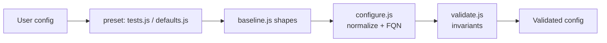

# Validation & Normalization

Two pipeline stages: **`configure.js`** normalizes raw user config into canonical
entities (applying defaults, parsing URLs/names, computing FQNs), then
**`validate.js`** enforces domain invariants. Both export curried functions
`(config, next)` and run in sequence in the config pipeline.

## Normalization

### configure.js [MUST] <!-- id: file:lib/config/configure.js:configure.js -->

[configure.js](https://github.com/cliftonc/rascal/blob/master/lib/config/configure.js#L1-L367)

`module.exports = _.curry((rascalConfig, next) => {...})`. Mutates `rascalConfig`
in place and calls `next(err | null, rascalConfig)`.

Top-level flow ([configure.js:13-28](https://github.com/cliftonc/rascal/blob/master/lib/config/configure.js#L13-L28)):

```javascript
rascalConfig = _.defaultsDeep(rascalConfig, baseline);   // apply baseline shapes
configureVhosts(rascalConfig.vhosts);
configurePublications(rascalConfig.publications, rascalConfig.vhosts);
configureSubscriptions(rascalConfig.subscriptions, rascalConfig.vhosts);
configureShovels(rascalConfig.shovels);
configureCounters(rascalConfig.redeliveries.counters);
```

Normalization rules (the rebuild must reproduce each):

| Rule | Behavior | Source |
|------|----------|--------|
| Baseline merge | Deep-defaults the whole config from `baseline.js` | [13](https://github.com/cliftonc/rascal/blob/master/lib/config/configure.js#L13) |
| Vhost name | `name` set to collection key | [46](https://github.com/cliftonc/rascal/blob/master/lib/config/configure.js#L46) |
| Namespace `true` → UUID | `namespace === true` replaced by random UUID | [54](https://github.com/cliftonc/rascal/blob/master/lib/config/configure.js#L54) |
| Connection collapse | `connection` + `connections` merged → compact, unique `connections` array; string → `{ url }`; empty → `[{}]`; `connection` deleted | [58-73](https://github.com/cliftonc/rascal/blob/master/lib/config/configure.js#L58-L73) |
| Parse connection URL | URL parsed into protocol/user/password/hostname/port/vhost/options; user/password/hostname/vhost URI-decoded; query string → `options` | [88-97](https://github.com/cliftonc/rascal/blob/master/lib/config/configure.js#L88-L97) |
| Connection precedence | `_.defaultsDeep(url, config, defaults)` — URL attrs win over explicit config win over vhost defaults; `vhost` defaults to vhost name | [75-86](https://github.com/cliftonc/rascal/blob/master/lib/config/configure.js#L75-L86) |
| Build connection URL | Rebuilds `url` via `url.format`; vhost `/` → empty pathname; `loggableUrl` masks password (`:***@`) | [124-136](https://github.com/cliftonc/rascal/blob/master/lib/config/configure.js#L124-L136) |
| Connection index | strategy `fixed` → array index; else stable random per `hostname:port` | [138-145](https://github.com/cliftonc/rascal/blob/master/lib/config/configure.js#L138-L145) |
| Management connection | Inherits user/password/hostname from primary connection; URL parsed/formatted same way | [108-117](https://github.com/cliftonc/rascal/blob/master/lib/config/configure.js#L108-L117) |
| Default exchange | Always adds nameless exchange `{ '': {} }` | [277-279](https://github.com/cliftonc/rascal/blob/master/lib/config/configure.js#L277-L279) |
| Exchange FQN | `fullyQualifiedName = fqn.qualify(name, namespace)` | [282](https://github.com/cliftonc/rascal/blob/master/lib/config/configure.js#L282) |
| Queue replyTo `true` → UUID | `replyTo === true` replaced by UUID; used as FQN uniqueness suffix | [290](https://github.com/cliftonc/rascal/blob/master/lib/config/configure.js#L290), [296](https://github.com/cliftonc/rascal/blob/master/lib/config/configure.js#L296) |
| DLX qualification | `options.arguments['x-dead-letter-exchange']` FQN-qualified | [291](https://github.com/cliftonc/rascal/blob/master/lib/config/configure.js#L291), [351-356](https://github.com/cliftonc/rascal/blob/master/lib/config/configure.js#L351-L356) |
| Binding name parse | `"source [keys] -> destination"` parsed into source/destination/bindingKeys; keys split on `[,\s]+` | [317-332](https://github.com/cliftonc/rascal/blob/master/lib/config/configure.js#L317-L332) |
| Binding key expansion | Multiple binding keys → one binding per key, named `name:bindingKey` | [334-349](https://github.com/cliftonc/rascal/blob/master/lib/config/configure.js#L334-L349) |
| Qualify binding keys | If `qualifyBindingKeys`, FQN-qualify the binding key | [311-313](https://github.com/cliftonc/rascal/blob/master/lib/config/configure.js#L311-L313) |
| Auto publications | For each exchange and queue, auto-create a publication named `vhost/name` (or `/name` for `/`), `autoCreated: true`; user publications take precedence | [155-181](https://github.com/cliftonc/rascal/blob/master/lib/config/configure.js#L155-L181) |
| Auto subscriptions | For each queue, auto-create a subscription named `vhost/name`; user subscriptions take precedence | [212-229](https://github.com/cliftonc/rascal/blob/master/lib/config/configure.js#L212-L229) |
| Publication destination | `destination = fullyQualifiedName` of the target exchange/queue | [188-190](https://github.com/cliftonc/rascal/blob/master/lib/config/configure.js#L188-L190) |
| Publication replyTo | Resolved to reply queue's FQN; unknown reply queue throws | [192-197](https://github.com/cliftonc/rascal/blob/master/lib/config/configure.js#L192-L197) |
| Publication encryption | String value resolved to the named `config.encryption` profile | [199-201](https://github.com/cliftonc/rascal/blob/master/lib/config/configure.js#L199-L201) |
| Subscription source | `source = fullyQualifiedName` of the queue | [237](https://github.com/cliftonc/rascal/blob/master/lib/config/configure.js#L237) |
| Shovel name parse | `"subscription -> publication"` parsed into the two fields | [252-262](https://github.com/cliftonc/rascal/blob/master/lib/config/configure.js#L252-L262) |
| Counter type/defaults | `type` defaults to name; defaults pulled from `defaults.redeliveries.counters.{type}` | [269-275](https://github.com/cliftonc/rascal/blob/master/lib/config/configure.js#L269-L275) |
| Array → keyed collection | Arrays of exchanges/queues/bindings/shovels/counters keyed by `name`; strings → `{ name }`; unnamed → `unnamed-<uuid>` | [358-366](https://github.com/cliftonc/rascal/blob/master/lib/config/configure.js#L358-L366) |

#### Duplicate-name invariants (thrown during normalization) [MUST]

- Duplicate publication across different vhosts → `Duplicate publication: <name>` ([configure.js:186](https://github.com/cliftonc/rascal/blob/master/lib/config/configure.js#L186)).
- Duplicate subscription across different vhosts → `Duplicate subscription: <name>` ([configure.js:234](https://github.com/cliftonc/rascal/blob/master/lib/config/configure.js#L234)).
- Publication `replyTo` referencing an unknown reply queue → throws ([configure.js:195](https://github.com/cliftonc/rascal/blob/master/lib/config/configure.js#L195)).

## Validation Invariants

### validate.js [MUST] <!-- id: file:lib/config/validate.js:validate.js -->

[validate.js](https://github.com/cliftonc/rascal/blob/master/lib/config/validate.js#L1-L189)

`module.exports = _.curry((config, next) => {...})`. Throws on first violation;
returns `next(err, config)` or `next(null, config)`.

Order: vhosts → publications → subscriptions → encryption profiles → shovels
([validate.js:6-11](https://github.com/cliftonc/rascal/blob/master/lib/config/validate.js#L6-L11)).

The core mechanism is **allow-listing**: `validateAttributes` rejects any key not
in the explicit allowed set with "refers to an unsupported attribute"
([validate.js:33-35](https://github.com/cliftonc/rascal/blob/master/lib/config/validate.js#L33-L35)).

#### Vhost invariants [MUST]

| Invariant | Error | Source |
|-----------|-------|--------|
| At least one vhost | `No vhosts specified` | [18](https://github.com/cliftonc/rascal/blob/master/lib/config/validate.js#L18) |
| Allowed vhost attributes | unsupported attribute | [23](https://github.com/cliftonc/rascal/blob/master/lib/config/validate.js#L23) |
| connectionStrategy ∈ {random, fixed, undefined} | unknown connection strategy | [38-40](https://github.com/cliftonc/rascal/blob/master/lib/config/validate.js#L38-L40) |
| Allowed connection attributes | unsupported attribute | [42-45](https://github.com/cliftonc/rascal/blob/master/lib/config/validate.js#L42-L45) |
| Allowed management connection attributes | unsupported attribute | [47-51](https://github.com/cliftonc/rascal/blob/master/lib/config/validate.js#L47-L51) |
| publicationChannelPools keys ⊆ {regularPool, confirmPool} | unsupported attribute | [53-56](https://github.com/cliftonc/rascal/blob/master/lib/config/validate.js#L53-L56) |

#### Exchange / Queue invariants [MUST]

- Exchange allowed attrs: `fullyQualifiedName, name, assert, check, type, options` ([validate.js:68](https://github.com/cliftonc/rascal/blob/master/lib/config/validate.js#L68)).
- Queue allowed attrs: `fullyQualifiedName, name, assert, check, type, purge, replyTo, options` ([validate.js:76](https://github.com/cliftonc/rascal/blob/master/lib/config/validate.js#L76)).

#### Binding invariants [MUST]

| Invariant | Error | Source |
|-----------|-------|--------|
| Allowed binding attributes | unsupported attribute | [84](https://github.com/cliftonc/rascal/blob/master/lib/config/validate.js#L84) |
| `source` required | missing a source | [85](https://github.com/cliftonc/rascal/blob/master/lib/config/validate.js#L85) |
| `destination` required | missing a destination | [86](https://github.com/cliftonc/rascal/blob/master/lib/config/validate.js#L86) |
| `destinationType` required | missing a destination type | [87](https://github.com/cliftonc/rascal/blob/master/lib/config/validate.js#L87) |
| `destinationType` ∈ {queue, exchange} | invalid destination type | [88](https://github.com/cliftonc/rascal/blob/master/lib/config/validate.js#L88) |
| `source` references a known exchange | unknown exchange | [90-91](https://github.com/cliftonc/rascal/blob/master/lib/config/validate.js#L90-L91) |
| `destination` references known queue (if queue) | unknown queue | [93-95](https://github.com/cliftonc/rascal/blob/master/lib/config/validate.js#L93-L95) |
| `destination` references known exchange (if exchange) | unknown exchange | [96](https://github.com/cliftonc/rascal/blob/master/lib/config/validate.js#L96) |

#### Publication invariants [MUST]

| Invariant | Error | Source |
|-----------|-------|--------|
| Allowed publication attributes | unsupported attribute | [104](https://github.com/cliftonc/rascal/blob/master/lib/config/validate.js#L104) |
| `vhost` required | missing a vhost | [105](https://github.com/cliftonc/rascal/blob/master/lib/config/validate.js#L105) |
| Has `exchange` OR `queue` | missing an exchange or a queue | [106](https://github.com/cliftonc/rascal/blob/master/lib/config/validate.js#L106) |
| Not both `exchange` AND `queue` (XOR) | has an exchange and a queue | [107](https://github.com/cliftonc/rascal/blob/master/lib/config/validate.js#L107) |
| `vhost` references a known vhost | unknown vhost | [109-110](https://github.com/cliftonc/rascal/blob/master/lib/config/validate.js#L109-L110) |
| `exchange`/`queue` references a known target in that vhost | unknown exchange/queue | [112-118](https://github.com/cliftonc/rascal/blob/master/lib/config/validate.js#L112-L118) |
| `encryption` profile valid (if present) | (see encryption) | [120](https://github.com/cliftonc/rascal/blob/master/lib/config/validate.js#L120) |

#### Subscription invariants [MUST]

| Invariant | Error | Source |
|-----------|-------|--------|
| Allowed subscription attributes | unsupported attribute | [128-149](https://github.com/cliftonc/rascal/blob/master/lib/config/validate.js#L128-L149) |
| `vhost` required | missing a vhost | [151](https://github.com/cliftonc/rascal/blob/master/lib/config/validate.js#L151) |
| `queue` required | missing a queue | [152](https://github.com/cliftonc/rascal/blob/master/lib/config/validate.js#L152) |
| `vhost` references a known vhost | unknown vhost | [154-155](https://github.com/cliftonc/rascal/blob/master/lib/config/validate.js#L154-L155) |
| `queue` references a known queue in that vhost | unknown queue | [157-158](https://github.com/cliftonc/rascal/blob/master/lib/config/validate.js#L157-L158) |
| `redeliveries.counter` references a known counter | unknown counter | [160-161](https://github.com/cliftonc/rascal/blob/master/lib/config/validate.js#L160-L161) |
| `encryption` profiles valid (if present) | (see encryption) | [163](https://github.com/cliftonc/rascal/blob/master/lib/config/validate.js#L163) |

#### Encryption profile invariants [MUST]

| Invariant | Error | Source |
|-----------|-------|--------|
| Allowed attrs: name, key, algorithm, ivLength | unsupported attribute | [171](https://github.com/cliftonc/rascal/blob/master/lib/config/validate.js#L171) |
| `key` required | missing a key | [172](https://github.com/cliftonc/rascal/blob/master/lib/config/validate.js#L172) |
| `algorithm` required | missing an algorithm | [173](https://github.com/cliftonc/rascal/blob/master/lib/config/validate.js#L173) |
| `ivLength` required | missing ivLength | [174](https://github.com/cliftonc/rascal/blob/master/lib/config/validate.js#L174) |

#### Shovel invariants [MUST]

| Invariant | Error | Source |
|-----------|-------|--------|
| Allowed attrs: name, subscription, publication | unsupported attribute | [182](https://github.com/cliftonc/rascal/blob/master/lib/config/validate.js#L182) |
| `subscription` required | missing a subscription | [183](https://github.com/cliftonc/rascal/blob/master/lib/config/validate.js#L183) |
| `publication` required | missing a publication | [184](https://github.com/cliftonc/rascal/blob/master/lib/config/validate.js#L184) |
| `subscription` references a known subscription | unknown subscription | [186](https://github.com/cliftonc/rascal/blob/master/lib/config/validate.js#L186) |
| `publication` references a known publication | unknown publication | [187](https://github.com/cliftonc/rascal/blob/master/lib/config/validate.js#L187) |

## Config Pipeline



## Added Item (scanner-missed)

### schema.json [SHOULD] <!-- id: file:lib/config/schema.json:schema.json -->

[schema.json](https://github.com/cliftonc/rascal/blob/master/lib/config/schema.json#L1-L693)

A JSON Schema (693 lines) describing the externally-supplied config shape. Not in
the deterministic seed; it duplicates the entity/attribute contracts enforced
imperatively by `validate.js`. Tagged [SHOULD] — useful as a machine-readable
mirror of the validation rules, but the imperative validators are the source of
truth at runtime.
