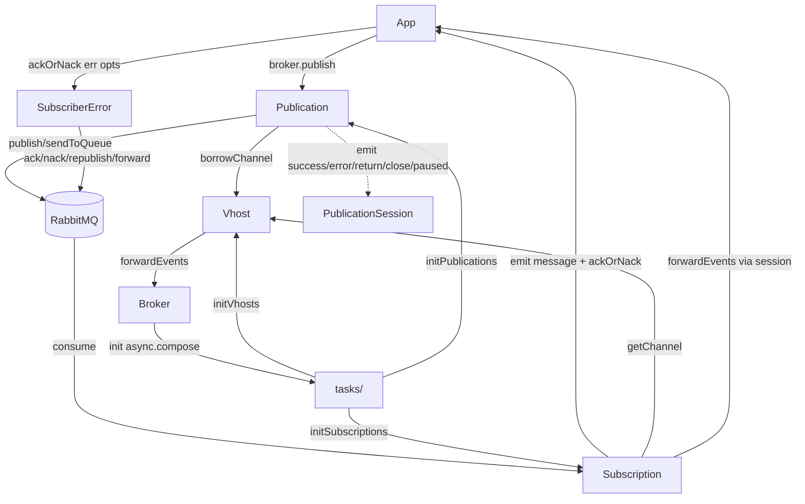

# Messaging Layer

The messaging layer is the entire `lib/amqp/` tree — the core of **rascal**, a config-driven RabbitMQ (amqplib) wrapper. It contains the `Broker` orchestrator, the `Vhost` connection/channel-pool manager, the `Publication`/`Subscription` abstractions with their sessions, the recovery/error pipeline, and a 25-file `async.compose` task pipeline that asserts topology and manages lifecycle.

**Seed:** `docs/unwind/.cache/seeds/messaging.json` — 36 candidate items, all documented below.

Link format: `https://github.com/cliftonc/rascal/blob/master/{path}#L{start}-L{end}`

## Sections

| Section | Contents | Status |
|---------|----------|--------|
| [broker.md](broker.md) | `Broker`, `BrokerAsPromised` — orchestration, lifecycle commands, publish/subscribe dispatch | done |
| [vhost.md](vhost.md) | `Vhost` — connection lifecycle, channel pooling (generic-pool), reconnection/backoff, events | done |
| [publication.md](publication.md) | `Publication`, `PublicationSession` — publish/forward, confirm vs no-confirm, encryption | done |
| [subscription.md](subscription.md) | `Subscription`, `SubscriberSession`, `SubscriberSessionAsPromised` — lazy subscribe, ack/nack, redeliveries, resubscription | done |
| [recovery.md](recovery.md) | `SubscriberError`, `XDeath` — recovery strategies (ack/nack/republish/forward/fallback-nack/unknown), defer, immediate nack | done |
| [tasks.md](tasks.md) | `tasks/` — 25-file `async.compose` task pipeline (connection, channels, vhost, exchanges, queues, bindings, init*) | done |

## Item Count

36 seeded items (10 core classes + `tasks/index.js` + 24 task files = 35 files; plus added symbols: recovery strategy types, key events). Coverage: all 36 documented. Added (scanner-missed) items: 6 recovery strategies, `Broker.create` factory contract, key event tables.

## Event Flow

## Cross-Cutting Conventions

- **Two API styles:** callback-based core (`Broker`, `SubscriberSession`, `Publication` sessions) and promise wrappers (`BrokerAsPromised`, `SubscriberSessionAsPromised`) that use `forward-emitter` to re-emit events and wrap callback methods in `Promise`.
- **Task contract:** every task is `_.curry((config, ctx, next) => …)` and calls `next(err, config, ctx)`, so they compose with `async.compose` (which runs right-to-left).
- **`ctx` threading:** the shared mutable context object (`connection`, `connectionIndex`, `connectionConfig`, `channels`, `vhosts`, `publications`, `counters`, `broker`, `components`, `purge` flag) flows through the whole chain.
- **`_rascal_id` tagging:** connections and channels are stamped with a uuid `_rascal_id` for logging/validation; channels also get `_rascal_closed`.
- **`setImmediate` around amqplib events:** disconnection handlers wrap their logic in `setImmediate` to avoid the amqplib accept loop swallowing thrown errors.
