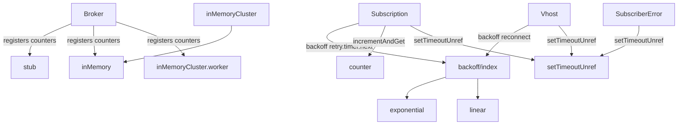

# Service Layer

The service layer of rascal is the composable supporting logic injected into the
`Broker` and consumed by `Subscription`/`Vhost`: **backoff/retry timer
strategies** and **redelivery counters**, plus the unref'd-timer utility that
underpins their scheduling.

## Sections
- [Backoff Strategies](backoff.md) - retry delay timer factory + exponential/linear strategies (3 items)
- [Counters](counters.md) - redelivery counter registry + stub/inMemory/inMemoryCluster (4 items)
- [Utilities](utilities.md) - unref'd timer helper (1 item)

## Item Count

8 seeded items, all documented:

| File | Section | Tag |
|------|---------|-----|
| lib/backoff/index.js | Backoff Strategies | [MUST] |
| lib/backoff/exponential.js | Backoff Strategies | [MUST] |
| lib/backoff/linear.js | Backoff Strategies | [MUST] |
| lib/counters/index.js | Counters | [SHOULD] |
| lib/counters/stub.js | Counters | [MUST] |
| lib/counters/inMemory.js | Counters | [MUST] |
| lib/counters/inMemoryCluster.js | Counters | [MUST] |
| lib/utils/setTimeoutUnref.js | Utilities | [SHOULD] |

## Public Contracts

### Backoff timer

`backoff(options)` returns a timer object:

```js
{ next(): number, reset(): void }
```

- `next()` returns the next retry delay in milliseconds.
- `reset()` resets internal state to the starting delay (no-op for linear).

### Counter

Every counter factory returns an object:

```js
{ incrementAndGet(key, callback): void }   // callback(err, count)
```

`key` is `"${subscriptionName}/${messageId}"` (Subscription.js:212). The callback
receives the post-increment redelivery count. All implementations swallow errors
and return `1` (or `0` for stub) on failure rather than propagating.

## Consumers



- `Broker.create` ([Broker.js:23-27](https://github.com/cliftonc/rascal/blob/master/lib/amqp/Broker.js#L23-L27)) registers the three built-in counters as defaults, overridable via `components.counters`.
- `Subscription` ([Subscription.js:20](https://github.com/cliftonc/rascal/blob/master/lib/amqp/Subscription.js#L20)) builds a backoff timer from `subscriptionConfig.retry` and calls `timer.next()` on each resubscription attempt ([Subscription.js:330](https://github.com/cliftonc/rascal/blob/master/lib/amqp/Subscription.js#L330)).
- `Vhost` ([Vhost.js:33,58](https://github.com/cliftonc/rascal/blob/master/lib/amqp/Vhost.js#L33-L58)) builds a backoff timer for connection retry.

## Unknowns

None. All seeded items are concrete and fully covered.
